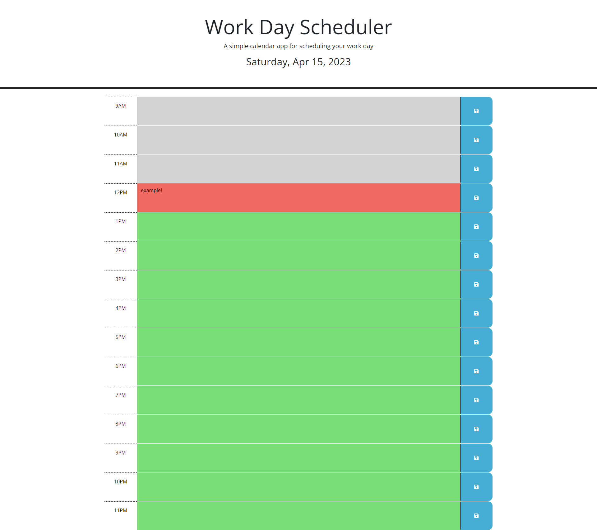

# How Well Do You Know Rock Climbing?

## Description

What I have created is a calendar app that you can use to keep track of your busy daily schedule. The reason I built this product is to to incorporate the new concepts learned in Jquery, dayJS , event listeners, objects and local storage. Mastery of these concepts will help with future projects of larger magnitude. 
## Table of Contents (Optional)

- [Usage](#usage)
- [Credits](#credits)
- [License](#license)

## Usage

Navigate to the urls located below and click inside time block text areas to begin planning out your day. Remember to click the save button to save that text to your local storage so that it stays upon refresh of the page. You can edit the text and overwrite it if you need to change it at a later date, or clear cache. You should notice that the time blocks will change color automatically based on the local time. Grey means that time block has already passed, red means that the current time block is lined up with your current local time, and green means a time block that is coming up. 

[Github Page](https://github.com/Dannymak1993/Organizing-Your-Life)

[Repository](https://github.com/Dannymak1993/How-Well-Do-You-Know-Rock-Climbing-)

## Credits

I googled many concepts referring to Jquery and DayJS. I also used both of those in my HTML so they are linked accordingly. 

## License

The MIT License (MIT)

Copyright (c) 2015 Chris Kibble

Permission is hereby granted, free of charge, to any person obtaining a copy of this software and associated documentation files (the "Software"), to deal in the Software without restriction, including without limitation the rights to use, copy, modify, merge, publish, distribute, sublicense, and/or sell copies of the Software, and to permit persons to whom the Software is furnished to do so, subject to the following conditions:

The above copyright notice and this permission notice shall be included in all copies or substantial portions of the Software.

THE SOFTWARE IS PROVIDED "AS IS", WITHOUT WARRANTY OF ANY KIND, EXPRESS OR IMPLIED, INCLUDING BUT NOT LIMITED TO THE WARRANTIES OF MERCHANTABILITY, FITNESS FOR A PARTICULAR PURPOSE AND NONINFRINGEMENT. IN NO EVENT SHALL THE AUTHORS OR COPYRIGHT HOLDERS BE LIABLE FOR ANY CLAIM, DAMAGES OR OTHER LIABILITY, WHETHER IN AN ACTION OF CONTRACT, TORT OR OTHERWISE, ARISING FROM, OUT OF OR IN CONNECTION WITH THE SOFTWARE OR THE USE OR OTHER DEALINGS IN THE SOFTWARE.
